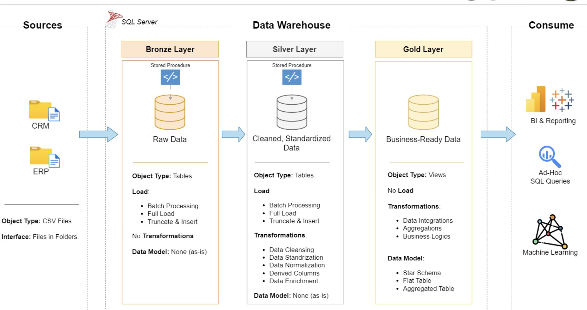
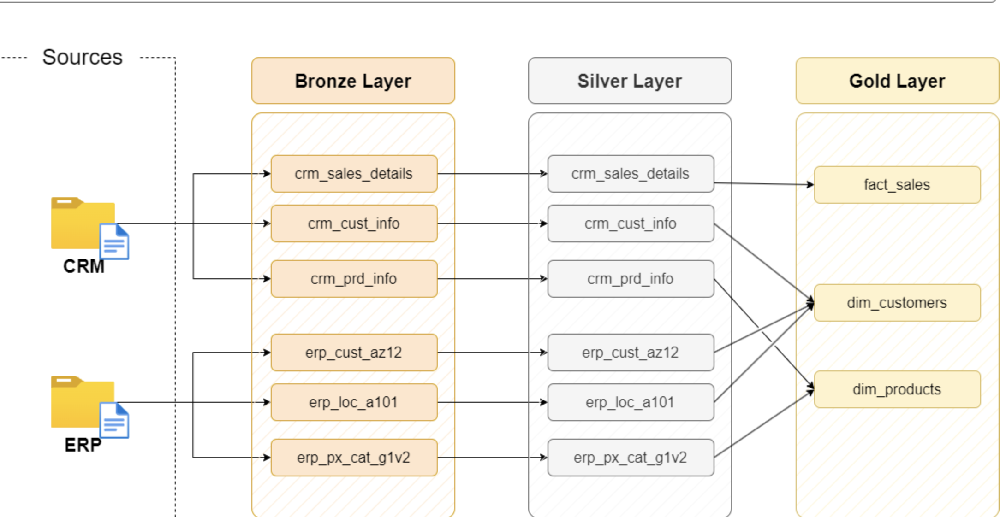
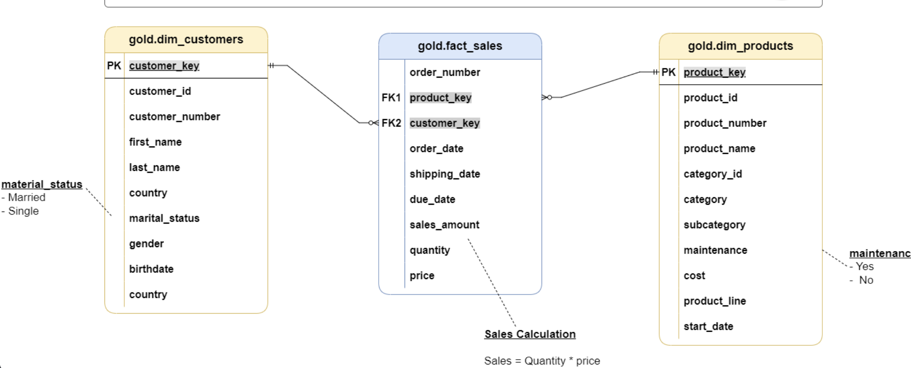

### Construction d'un data lakehouse avec Spark

## Architecture du projet


## Data Lineage du projet



## Data marts


## Aprés la transformation dans la couche silver on a eu obtenu ces nouveaux dataframes stocker dans data
```text
===== PIPELINE START =====

[INFO] Démarrage de la transformation Silver pour cust_info...
[INFO] Lecture du fichier Bronze : data/bronze/cust_info.parquet
[INFO] Nombre de lignes Bronze : 18494
[INFO] Après filtrage cst_id : 18490
[INFO] Après déduplication : 18484
[INFO] Silver écrit dans data/silver/cust_info.csv
[INFO] Transformation Silver terminée


[INFO] ===== Démarrage de la transformation Silver : prd_info =====
[INFO] Lecture du fichier Bronze : data/bronze/prd_info.parquet
[INFO] 397 lignes lues depuis Bronze
[INFO] Extraction cat_id et nettoyage prd_key
[INFO] Remplacement des coûts NULL par 0
[INFO] Standardisation des codes prd_line
[INFO] Calcul des dates de validité (prd_start_dt / prd_end_dt)
[INFO] Aperçu final Silver prd_info
+------+-------+--------------------+--------+--------+------------+----------+--------------------------+------+--------------------------+
|prd_id|prd_key|prd_nm              |prd_cost|prd_line|prd_start_dt|prd_end_dt|_ingestion_date           |cat_id|_processed_timestamp      |
+------+-------+--------------------+--------+--------+------------+----------+--------------------------+------+--------------------------+
|601   |BB-7421|LL Bottom Bracket   |24      |n/a     |2013-07-01  |NULL      |2026-01-29 10:47:36.526975|CO_BB |2026-01-29 11:27:44.509196|
|602   |BB-8107|ML Bottom Bracket   |45      |n/a     |2013-07-01  |NULL      |2026-01-29 10:47:36.526975|CO_BB |2026-01-29 11:27:44.509196|
|603   |BB-9108|HL Bottom Bracket   |54      |n/a     |2013-07-01  |NULL      |2026-01-29 10:47:36.526975|CO_BB |2026-01-29 11:27:44.509196|
|478   |BC-M005|Mountain Bottle Cage|4       |Mountain|2013-07-01  |NULL      |2026-01-29 10:47:36.526975|AC_BC |2026-01-29 11:27:44.509196|
|479   |BC-R205|Road Bottle Cage    |3       |Road    |2013-07-01  |NULL      |2026-01-29 10:47:36.526975|AC_BC |2026-01-29 11:27:44.509196|
+------+-------+--------------------+--------+--------+------------+----------+--------------------------+------+--------------------------+
only showing top 5 rows
[INFO] Silver prd_info écrit dans : data/silver/prd_info.csv
[INFO] ===== Transformation Silver prd_info terminée =====


[INFO] ===== Démarrage de la transformation Silver : sales_details =====
[INFO] Lecture du fichier Bronze : data/bronze/sales_details.parquet
[INFO] 60398 lignes lues depuis Bronze
+-----------+-----------+-----------+------------+-----------+----------+---------+------------+---------+--------------------------+
|sls_ord_num|sls_prd_key|sls_cust_id|sls_order_dt|sls_ship_dt|sls_due_dt|sls_sales|sls_quantity|sls_price|_ingestion_date           |
+-----------+-----------+-----------+------------+-----------+----------+---------+------------+---------+--------------------------+
|SO43697    |BK-R93R-62 |21768      |20101229    |20110105   |20110110  |3578     |1           |3578     |2026-01-29 10:47:36.721476|
|SO43698    |BK-M82S-44 |28389      |20101229    |20110105   |20110110  |3400     |1           |3400     |2026-01-29 10:47:36.721476|
|SO43699    |BK-M82S-44 |25863      |20101229    |20110105   |20110110  |3400     |1           |3400     |2026-01-29 10:47:36.721476|
|SO43700    |BK-R50B-62 |14501      |20101229    |20110105   |20110110  |699      |1           |699      |2026-01-29 10:47:36.721476|
|SO43701    |BK-M82S-44 |11003      |20101229    |20110105   |20110110  |3400     |1           |3400     |2026-01-29 10:47:36.721476|
+-----------+-----------+-----------+------------+-----------+----------+---------+------------+---------+--------------------------+
only showing top 5 rows
[INFO] Nettoyage et conversion des dates (order / ship / due)
[INFO] Recalcul sls_sales si NULL, <= 0 ou incohérent
[INFO] Recalcul sls_price si NULL ou <= 0
[INFO] Aperçu final Silver sales_details
+-----------+-----------+-----------+------------+-----------+----------+---------+------------+---------+
|sls_ord_num|sls_prd_key|sls_cust_id|sls_order_dt|sls_ship_dt|sls_due_dt|sls_sales|sls_quantity|sls_price|
+-----------+-----------+-----------+------------+-----------+----------+---------+------------+---------+
|SO43697    |BK-R93R-62 |21768      |2010-12-29  |2011-01-05 |2011-01-10|3578     |1           |3578.0   |
|SO43698    |BK-M82S-44 |28389      |2010-12-29  |2011-01-05 |2011-01-10|3400     |1           |3400.0   |
|SO43699    |BK-M82S-44 |25863      |2010-12-29  |2011-01-05 |2011-01-10|3400     |1           |3400.0   |
|SO43700    |BK-R50B-62 |14501      |2010-12-29  |2011-01-05 |2011-01-10|699      |1           |699.0    |
|SO43701    |BK-M82S-44 |11003      |2010-12-29  |2011-01-05 |2011-01-10|3400     |1           |3400.0   |
+-----------+-----------+-----------+------------+-----------+----------+---------+------------+---------+
only showing top 5 rows
[INFO] Silver sales_details écrit dans : data/silver/sales_details
[INFO] ===== Transformation Silver sales_details terminée =====


[INFO] ===== Démarrage de la transformation Silver : cust_az12 =====
[INFO] Lecture du fichier Bronze : data/bronze/cust_az12.parquet
[INFO] 18484 lignes lues depuis Bronze
[INFO] Normalisation des IDs client (cid)
[INFO] Remplacer les dates de naissance futures par NULL
[INFO] Normalisation des valeurs de genre
[INFO] Aperçu final Silver cust_az12
+----------+----------+------+--------------------------+--------------------------+
|cid       |bdate     |gen   |_ingestion_date           |_processed_timestamp      |
+----------+----------+------+--------------------------+--------------------------+
|AW00011000|1971-10-06|Male  |2026-01-29 10:47:37.006493|2026-01-29 11:27:45.982843|
|AW00011001|1976-05-10|Male  |2026-01-29 10:47:37.006493|2026-01-29 11:27:45.982843|
|AW00011002|1971-02-09|Male  |2026-01-29 10:47:37.006493|2026-01-29 11:27:45.982843|
|AW00011003|1973-08-14|Female|2026-01-29 10:47:37.006493|2026-01-29 11:27:45.982843|
|AW00011004|1979-08-05|Female|2026-01-29 10:47:37.006493|2026-01-29 11:27:45.982843|
+----------+----------+------+--------------------------+--------------------------+
only showing top 5 rows
[INFO] Silver cust_az12 écrit dans : data/silver/cust_az12
[INFO] ===== Transformation Silver cust_az12 terminée =====


[INFO] ===== Démarrage de la transformation Silver : loc_a101 =====
[INFO] Lecture du fichier Bronze : data/bronze/LOC_A101.parquet
[INFO] 18484 lignes lues depuis Bronze
[INFO] Normalisation des IDs client (cid)
[INFO] Normalisation des codes pays
[INFO] Aperçu final Silver loc_a101
+----------+---------+--------------------------+--------------------------+
|cid       |cntry    |_ingestion_date           |_processed_timestamp      |
+----------+---------+--------------------------+--------------------------+
|AW00011000|Australia|2026-01-29 10:47:37.188312|2026-01-29 11:27:46.221532|
|AW00011001|Australia|2026-01-29 10:47:37.188312|2026-01-29 11:27:46.221532|
|AW00011002|Australia|2026-01-29 10:47:37.188312|2026-01-29 11:27:46.221532|
|AW00011003|Australia|2026-01-29 10:47:37.188312|2026-01-29 11:27:46.221532|
|AW00011004|Australia|2026-01-29 10:47:37.188312|2026-01-29 11:27:46.221532|
+----------+---------+--------------------------+--------------------------+
only showing top 5 rows
[INFO] Silver loc_a101 écrit dans : data/silver/loc_a101.csv
[INFO] ===== Transformation Silver loc_a101 terminée =====


[INFO] ===== Démarrage de la transformation Silver : px_cat_g1v2 =====
[INFO] Lecture du fichier Bronze : data/bronze/PX_CAT_G1V2.parquet
[INFO] 37 lignes lues depuis Bronze
[INFO] Aperçu final Silver px_cat_g1v2
+-----+-----------+-----------------+-----------+--------------------------+--------------------------+
|ID   |CAT        |SUBCAT           |MAINTENANCE|_ingestion_date           |_processed_timestamp      |
+-----+-----------+-----------------+-----------+--------------------------+--------------------------+
|AC_BR|Accessories|Bike Racks       |Yes        |2026-01-29 10:47:37.330997|2026-01-29 11:27:46.391006|
|AC_BS|Accessories|Bike Stands      |No         |2026-01-29 10:47:37.330997|2026-01-29 11:27:46.391006|
|AC_BC|Accessories|Bottles and Cages|No         |2026-01-29 10:47:37.330997|2026-01-29 11:27:46.391006|
|AC_CL|Accessories|Cleaners         |Yes        |2026-01-29 10:47:37.330997|2026-01-29 11:27:46.391006|
|AC_FE|Accessories|Fenders          |No         |2026-01-29 10:47:37.330997|2026-01-29 11:27:46.391006|
+-----+-----------+-----------------+-----------+--------------------------+--------------------------+
only showing top 5 rows
[INFO] Silver px_cat_g1v2 écrit dans : data/silver/px_cat_g1v2.csv
[INFO] ===== Transformation Silver px_cat_g1v2 terminée =====

===== PIPELINE END =====


